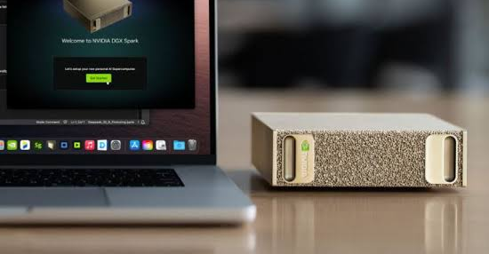
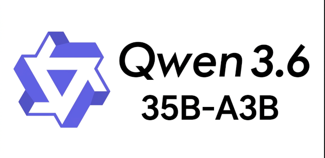
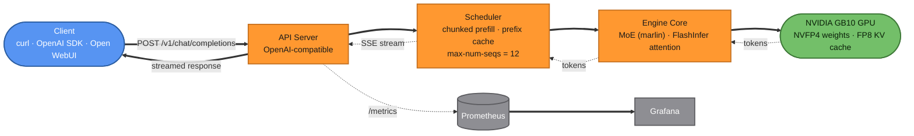
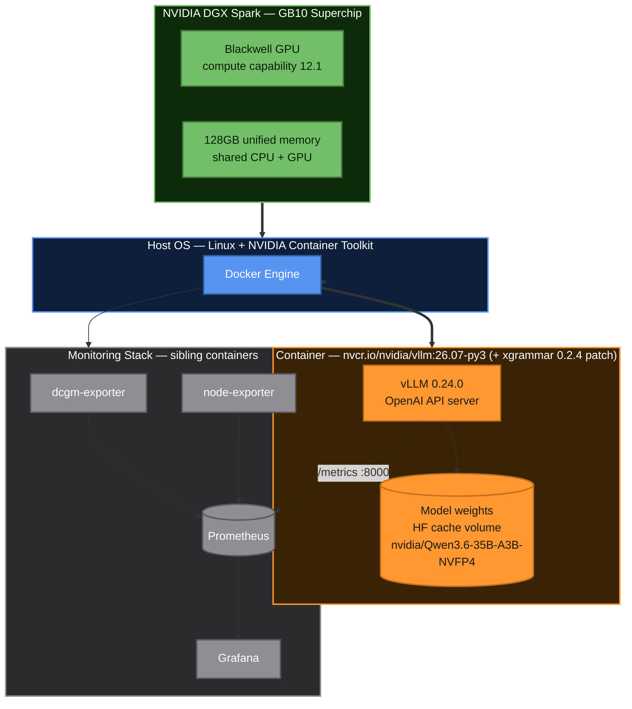
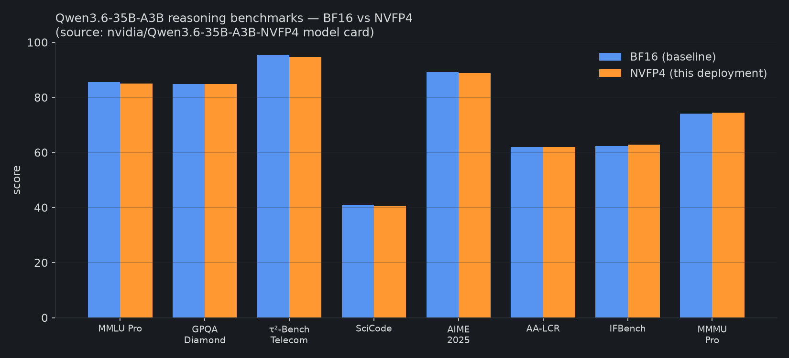
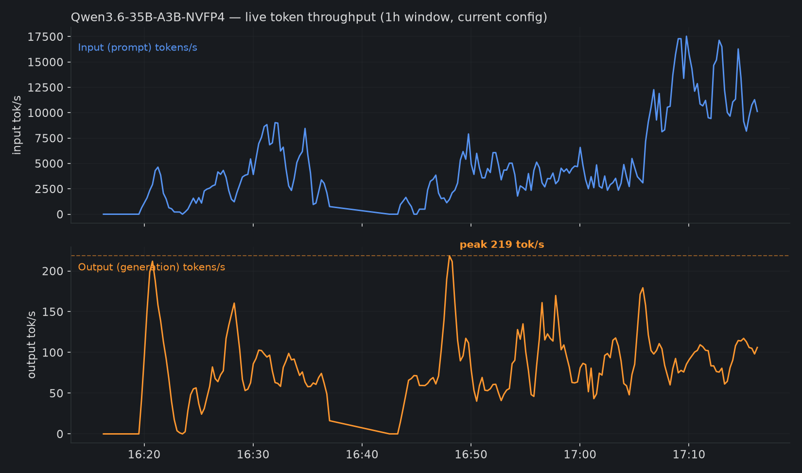
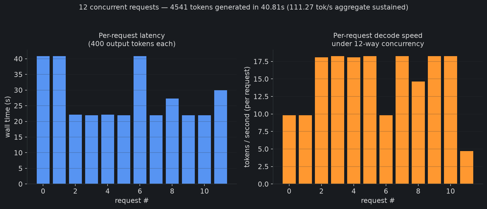
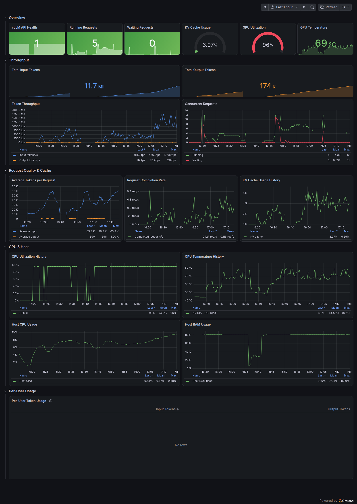

<div align="center">



# Qwen3.6-35B-A3B-NVFP4 on NVIDIA DGX Spark (GB10)

**Production vLLM deployment recipe — 12 concurrent users, 262K context, 219 tok/s peak output**

[](https://huggingface.co/nvidia/Qwen3.6-35B-A3B-NVFP4)
[](https://github.com/vllm-project/vllm)
[-76B900)](https://www.nvidia.com/en-us/products/workstations/dgx-spark/)
[](https://www.apache.org/licenses/LICENSE-2.0)
[](#configuration-reference)

</div>

---

## Overview

<div align="center">

</div>

This repository is the exact, currently-running configuration used to serve
[**`nvidia/Qwen3.6-35B-A3B-NVFP4`**](https://huggingface.co/nvidia/Qwen3.6-35B-A3B-NVFP4)
— a 35B-total / 3B-active Mixture-of-Experts model, NVIDIA's NVFP4
re-quantization of [Qwen/Qwen3.6-35B-A3B](https://huggingface.co/Qwen/Qwen3.6-35B-A3B)
— on a single **NVIDIA DGX Spark (GB10, Blackwell, 128GB unified memory)**.

Clone this repo, run one script, and you get the same server: **262,144-token
context**, **12 concurrent requests**, **prefix caching**, and a measured
**peak of 219 output tokens/sec**, on a single GPU with no cluster required.

> Everything in this README is sourced from a live deployment — the
> screenshot, the charts, and the numbers below were captured from the
> actual running system, not projected or estimated. See
> [`docs/ENGINEERING.md`](docs/ENGINEERING.md) for the full methodology and raw data.

## Table of Contents

- [Architecture](#architecture)
- [Hardware & Software Requirements](#hardware--software-requirements)
- [Quick Start](#quick-start)
- [Manual Setup — Step by Step](#manual-setup--step-by-step)
- [Configuration Reference](#configuration-reference)
- [Benchmarks](#benchmarks)
  - [Reasoning Benchmarks](#reasoning-benchmarks)
  - [Throughput Benchmarks](#throughput-benchmarks)
  - [Concurrency Load Test](#concurrency-load-test-12-simultaneous-requests)
- [Live Monitoring Dashboard](#live-monitoring-dashboard)
- [Client Usage](#client-usage)
- [Repository Layout](#repository-layout)
- [Troubleshooting](#troubleshooting)
- [Credits & License](#credits--license)

---

## Architecture

### Request flow



### System / hardware block diagram



## Hardware & Software Requirements

| Component | Requirement | Notes |
|---|---|---|
| GPU | 1x NVIDIA Blackwell GPU (SM ≥ 12.0) | Tested on **DGX Spark (GB10)** |
| Memory | ≥ 32GB GPU-addressable memory | GB10's 128GB is unified CPU+GPU memory |
| Driver | NVIDIA driver with CUDA 13.x support | `580.173.02` used here |
| OS | Linux (aarch64 or x86_64) | DGX Spark ships aarch64 |
| Docker | Docker Engine + NVIDIA Container Toolkit | `--gpus all` must work |
| Disk | ~25GB free | Model weights are ~21.8GB |
| Network | Outbound HTTPS to huggingface.co | For the first model pull |

## Quick Start

**One line**, on any single-Blackwell-GPU box with Docker + the NVIDIA
Container Toolkit already set up:

```bash
curl -fsSL https://raw.githubusercontent.com/Hitheshkaranth/Qwen-3_6_Model_DGX_Spark_Setup/main/install.sh | bash
```

This checks prerequisites (Docker, GPU visibility), clones the repo, builds
the patched image, and starts the server — safe to re-run if it stops partway.

Prefer to clone it yourself first? Same result:

```bash
git clone https://github.com/Hitheshkaranth/Qwen-3_6_Model_DGX_Spark_Setup.git && cd Qwen-3_6_Model_DGX_Spark_Setup && ./run.sh
```

Either way, first run downloads the ~21.8GB checkpoint from Hugging Face into
a named Docker volume (`qwen3.6-dgx-spark-hf-cache`), so subsequent restarts
skip the download entirely.

## Manual Setup — Step by Step

If you'd rather run each step yourself instead of using `run.sh`:

**1. Confirm the GPU is visible to Docker**

```bash
docker run --rm --gpus all nvidia/cuda:12.6.0-base-ubuntu22.04 nvidia-smi
```

You should see your GPU listed. If this fails, install the
[NVIDIA Container Toolkit](https://docs.nvidia.com/datacenter/cloud-native/container-toolkit/latest/install-guide.html)
first.

**2. Build the patched vLLM image**

```bash
docker build -t vllm-qwen36:local .
```

This starts from `nvcr.io/nvidia/vllm:26.07-py3` and applies one patch —
upgrading `xgrammar` to `0.2.4` — because the base image's pinned `0.2.0`
is missing `normalize_tool_choice`, which this vLLM build calls whenever a
request includes `tools`. Without the patch, any tool-calling request 500s.
See the [`Dockerfile`](Dockerfile).

**3. Create a named volume for the model cache (optional but recommended)**

```bash
docker volume create vllm-huggingface-cache
```

This persists the downloaded weights across container restarts/rebuilds.

**4. Run the container**

```bash
docker run -d \
  --name vllm \
  --restart unless-stopped \
  --gpus all \
  --ipc host \
  -p 8000:8000 \
  -v vllm-huggingface-cache:/root/.cache/huggingface \
  vllm-qwen36:local \
  python3 -m vllm.entrypoints.openai.api_server \
    --model nvidia/Qwen3.6-35B-A3B-NVFP4 \
    --gpu-memory-utilization 0.70 \
    --max-model-len 262144 \
    --max-num-seqs 12 \
    --max-num-batched-tokens 8192 \
    --enable-prefix-caching \
    --kv-cache-dtype fp8 \
    --moe-backend marlin \
    --reasoning-parser qwen3 \
    --enable-auto-tool-choice \
    --tool-call-parser qwen3_coder \
    --host 0.0.0.0 \
    --port 8000
```

**5. Watch it come up**

```bash
docker logs -f vllm
```

Startup takes **3-5 minutes** on first boot: weight loading (~2 min),
`torch.compile` warmup, FP8/FP4 GEMM autotuning, and CUDA graph capture.
You'll know it's ready when you see:

```
INFO:     Application startup complete.
```

**6. Verify it's serving**

```bash
curl http://localhost:8000/v1/models

curl http://localhost:8000/v1/chat/completions \
  -H "Content-Type: application/json" \
  -d '{"model":"nvidia/Qwen3.6-35B-A3B-NVFP4","messages":[{"role":"user","content":"Say OK."}],"max_tokens":10}'
```

**7. (Optional) Bring up monitoring**

The [`docs/ENGINEERING.md`](docs/ENGINEERING.md) file documents the full
Prometheus + Grafana + DCGM stack used to produce the benchmarks in this
README, including the exact `prometheus.yml` scrape config and the
Grafana dashboard JSON, if you want the same observability.

## Configuration Reference

Every flag below is a deliberate choice, not a default — most were tuned
against this exact GB10 box. Full rationale for each is in
[`docs/ENGINEERING.md`](docs/ENGINEERING.md).

| Flag | Value | Why |
|---|---|---|
| `--gpu-memory-utilization` | `0.70` | On this unified-memory box, pushing higher caused concurrency to collapse under load. Learned empirically, held as a hard ceiling since. |
| `--max-model-len` | `262144` | The model's native max context (`max_position_embeddings` in `config.json`). Started at 131072, raised after confirming KV-cache headroom. |
| `--max-num-seqs` | `12` | Target concurrent-user count. |
| `--max-num-batched-tokens` | `8192` | Without this, vLLM's scheduler silently clamps the batched-token budget much lower under this model's config, hurting prefill throughput under concurrent load. Value matches the model's own published DGX Spark recipe. |
| `--enable-prefix-caching` | on | Reuses KV cache across requests sharing a prompt prefix (system prompts, multi-turn chat). Off by default; recipe-recommended for GB10. |
| `--kv-cache-dtype` | `fp8` | Halves KV-cache memory footprint vs bf16, extending effective context/concurrency headroom. |
| `--moe-backend` | `marlin` | The MoE kernel backend validated for this model on GB10 (SM 12.1); other backends (FlashInfer CUTEDSL/TRTLLM/CUTLASS) are available but this is the one the model's own hardware recipe specifies for Spark. |
| `--reasoning-parser` | `qwen3` | The chat template opens every assistant turn with `<think>`; without this the whole reasoning block lands in `message.content`. |
| `--enable-auto-tool-choice` / `--tool-call-parser` | `qwen3_coder` | Enables OpenAI-style function calling. |

## Benchmarks

All numbers below were captured live from this exact deployment — see
[`benchmarks/`](benchmarks/) for the raw data and the scripts that produced them.

### Reasoning Benchmarks

Official accuracy numbers from the
[NVIDIA NVFP4 model card](https://huggingface.co/nvidia/Qwen3.6-35B-A3B-NVFP4#evaluation),
comparing this NVFP4 checkpoint against the full-precision BF16 baseline —
NVFP4 quantization costs less than a point on almost every benchmark:



| Benchmark | BF16 | NVFP4 (this deployment) |
|---|---|---|
| MMLU Pro | 85.6 | 85.0 |
| GPQA Diamond | 84.9 | 84.8 |
| τ²-Bench Telecom | 95.5 | 94.7 |
| SciCode | 40.8 | 40.6 |
| AIME 2025 | 89.2 | 88.8 |
| AA-LCR | 62.0 | 62.0 |
| IFBench | 62.3 | 62.8 |
| MMMU Pro | 74.1 | 74.5 |

### Throughput Benchmarks

One hour of real production traffic on this server, scraped from Prometheus:



**Peak output throughput observed: 219 tokens/sec** (confirmed independently
via both the Grafana dashboard's own recorded max and a dedicated 12-way
concurrent load test below).

### Concurrency Load Test (12 simultaneous requests)

A controlled benchmark — 12 concurrent chat completions, 400 output tokens
each, thinking disabled — run against this exact server
([`benchmarks/load_test_12_concurrent.py`](benchmarks/load_test_12_concurrent.py)):



| Metric | Value |
|---|---|
| Concurrent requests | 12 |
| Total tokens generated | 4,541 |
| Total wall time | 40.81s |
| Aggregate sustained throughput | 111.3 tok/s |
| **Peak instantaneous throughput (Prometheus, 15s window)** | **224.3 tok/s** |
| KV-cache concurrency headroom at full 262K context | 22.55x |

Raw results: [`benchmarks/load_test_result.json`](benchmarks/load_test_result.json).

## Live Monitoring Dashboard

Real screenshot of the Grafana dashboard monitoring this deployment
(Prometheus + DCGM + node-exporter), captured during live traffic:



Panels shown: API health, running/waiting requests, KV-cache usage, GPU
utilization & temperature, token throughput, concurrent requests, average
tokens per request, request completion rate, host CPU/RAM, and per-user
token usage (via Open WebUI integration).

## Client Usage

```python
from openai import OpenAI

client = OpenAI(api_key="EMPTY", base_url="http://localhost:8000/v1")

resp = client.chat.completions.create(
    model="nvidia/Qwen3.6-35B-A3B-NVFP4",
    messages=[{"role": "user", "content": "Explain the CAP theorem."}],
    max_tokens=512,
)
print(resp.choices[0].message.content)
```

To disable the model's default thinking mode for faster, direct answers:

```python
resp = client.chat.completions.create(
    model="nvidia/Qwen3.6-35B-A3B-NVFP4",
    messages=[{"role": "user", "content": "Say OK."}],
    extra_body={"chat_template_kwargs": {"enable_thinking": False}},
)
```

## Repository Layout

```
Qwen-3_6_Model_DGX_Spark_Setup/
├── README.md                          # this file
├── install.sh                         # one-line installer (curl | bash)
├── Dockerfile                         # nvcr vLLM base + xgrammar patch
├── run.sh                             # build + run, one command
├── benchmarks/
│   ├── load_test_12_concurrent.py     # 12-way concurrency benchmark script
│   ├── load_test_result.json          # raw results from the run cited above
│   ├── throughput_history.png         # 1h real Prometheus history
│   ├── concurrency_load_test.png      # per-request latency/throughput
│   └── reasoning_benchmarks.png       # official BF16 vs NVFP4 accuracy
├── assets/
│   └── grafana-dashboard.png          # live dashboard screenshot
└── docs/
    └── ENGINEERING.md                 # full engineering log & raw data
```

## Troubleshooting

| Symptom | Fix |
|---|---|
| `CUDA out of memory` at startup | Lower `--gpu-memory-utilization` (try `0.6`), or lower `--max-model-len`. |
| Tool-calling requests 500 | Confirm the image was built from this repo's `Dockerfile` (needs the xgrammar patch), not the bare `nvcr.io/nvidia/vllm:26.07-py3` image. |
| Throughput collapses under concurrent load | Confirm `--gpu-memory-utilization` hasn't been raised above `0.70` — this box's unified memory architecture degrades badly past that point. |
| Slow time-to-first-token under load | Confirm `--max-num-batched-tokens 8192` is actually applied (check container's `non-default args` log line on startup). |
| Reasoning text leaking into the answer | Confirm `--reasoning-parser qwen3` is set. |

## Credits & License

- Base model: [Qwen/Qwen3.6-35B-A3B](https://huggingface.co/Qwen/Qwen3.6-35B-A3B) by the Qwen team (Alibaba).
- NVFP4 quantization: [nvidia/Qwen3.6-35B-A3B-NVFP4](https://huggingface.co/nvidia/Qwen3.6-35B-A3B-NVFP4) by NVIDIA, via [Model Optimizer](https://github.com/NVIDIA/Model-Optimizer).
- Serving engine: [vLLM](https://github.com/vllm-project/vllm).
- Model weights are distributed under **Apache 2.0** — see the
  [model card](https://huggingface.co/nvidia/Qwen3.6-35B-A3B-NVFP4) for full terms.
- This repository's own scripts/config: Apache 2.0.

<div align="center">
<br>

</div>
